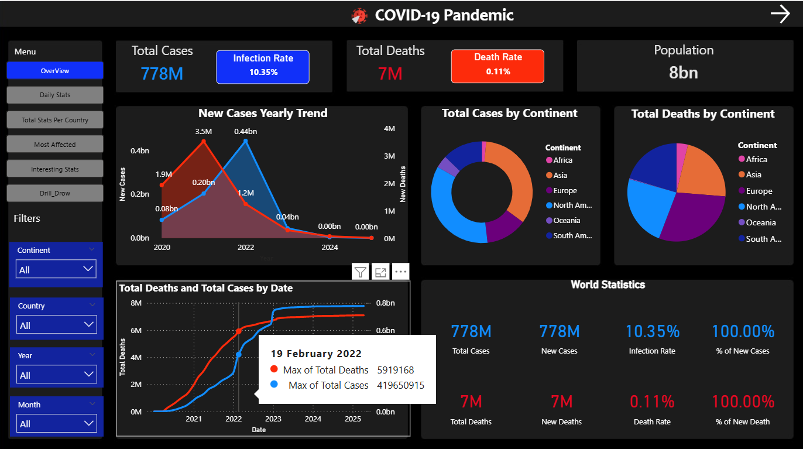
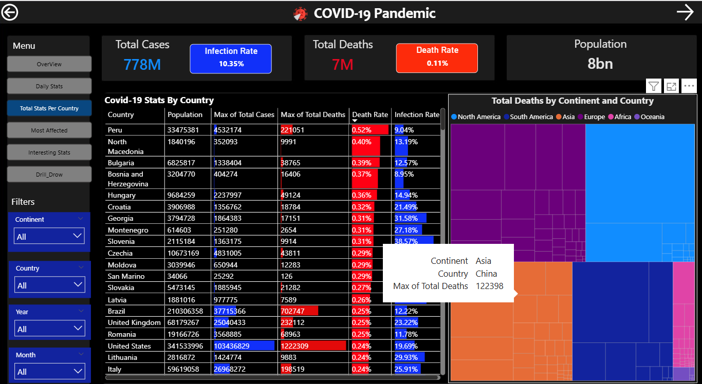

# COVID-19 Analysis & Visualization Dashboard

This project is a comprehensive analysis and visualization of the COVID-19 pandemic data across the globe. Using Power BI, I created interactive dashboards that allow users to explore various statistics, trends, and insights about the pandemic, including infection rates, death rates, and country/continent-specific data.

## Features

- **Global Overview**: Visualizes worldwide total cases, deaths, infection and death rates, and population estimates.
- **Trends Analysis**: Track yearly trends of new cases and deaths.
- **Country & Continent Stats**: Drill down into COVID-19 statistics by country and by continent.
- **Interactive Filters**: Filter data by continent, country, year, and month for focused analysis.
- **Visual Insights**: Leveraging Power BI's rich visualization features for charts, graphs, and maps.

## Built With

- [Power BI](https://powerbi.microsoft.com/) - For data modeling and interactive dashboard creation
- COVID-19 public datasets (WHO)

## Dashboard Snapshots

Below are sample images from the Power BI dashboard:

### 1. COVID-19 Stats by Country & Deaths by Continent

### 2. Global Overview & Yearly Trends

## How to Use

1. Open the Power BI dashboard file (`.pbix`) in Power BI Desktop.
2. Use the navigation panel to explore different views and insights.
3. Apply filters to customize the data view according to your interests.

## Insights

- Compare infection and death rates between countries and continents.
- Identify trends and anomaly periods in the spread of COVID-19.
- Interactive exploration enables deep dives into specific regions or timeframes.

## Getting Started

If you want to explore or extend the dashboard:

1. Clone this repository.
2. Download and install [Power BI Desktop](https://powerbi.microsoft.com/desktop/).
3. Open the `.pbix` file and connect to your COVID-19 data source if needed.

## Screenshots Reference

- **Image 1:** Shows a detailed breakdown of COVID-19 stats per country and a treemap of total deaths by continent and country.
- **Image 2:** Displays the global overview, yearly trend of new cases, and pie charts for cases and deaths by continent.

## Credits

- Data sources: WHO
- Visualization: Power BI
- Author: Stacy-Kelvin Adaisky Irutingabo

## License

kelvinadaisky
---

> *For any questions or contributions, feel free to open an issue or submit a pull request!*
